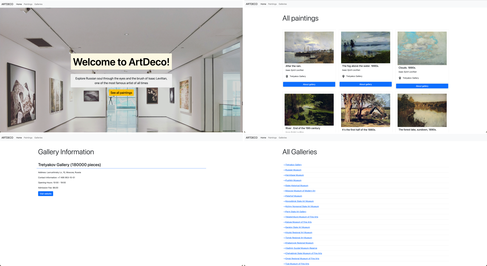

# Assignment 1: ArtDeco Web Application

This assignment demonstrates the integration of PHP and MySQL to create a dynamic database-driven web application. The project involves creating a MySQL database table and populating it with two open data sources that are connected with foreign key and include various data types such as text, numbers, and dates. Using PHP variables and loops, the data is retrieved and displayed on a web page. Bootstrap is employed to enhance the presentation and responsiveness of the content.

## Interface

The application focuses on showcasing paintings and galleries, particularly highlighting the works of Isaac Levittan.

1. The "Homepage" features a large, welcoming banner that invites users to explore Levittan’s paintings. “See all paintings” button calls to action and encourages further exploration of the art collection.
2. The “All Paintings” page showcases a curated selection of Levittan’s works, each displayed with its title, the artist’s name, and the associated gallery (Tretyakov Gallery). Each painting card includes an “About gallery” button, offering additional information about the gallery where the painting is housed.
3. The “Gallery Information” page provides detailed information about the specific gallery, including the total number of pieces, its address, contact information, opening hours, and admission fee. A “Visit website” button is also available for users seeking more detailed information about the gallery.
4. The “All Galleries” page lists various galleries, each with a clickable link for more information.

